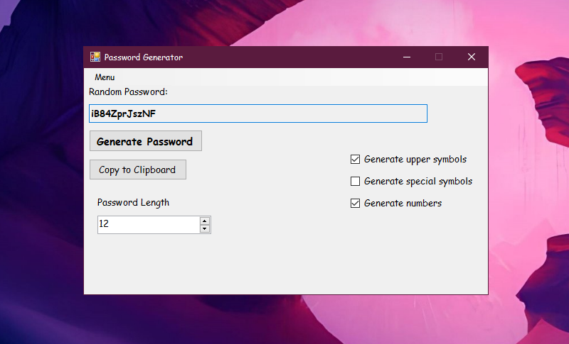

# 🔐 Password Generator

**Password Generator** is an application that generates secure passwords based on user preferences.

---

## ⚙ Technical Information
- This project is written in **C++ using Qt 6.0**
---

## ✨ Features
- 💾 Saves and loads user preferences
- 🔢 Adjustable password length (6 to 128 characters)
- 🧩 Customizable character sets:
  - Uppercase letters (A–Z)
  - Special characters (`%`, `$`, `&`, `@`)
  - Numbers (0–9)
- 📋 One-click copy to clipboard
  - Optional: auto-copy generated password

---

## 📁 Project Status
✅ Completed